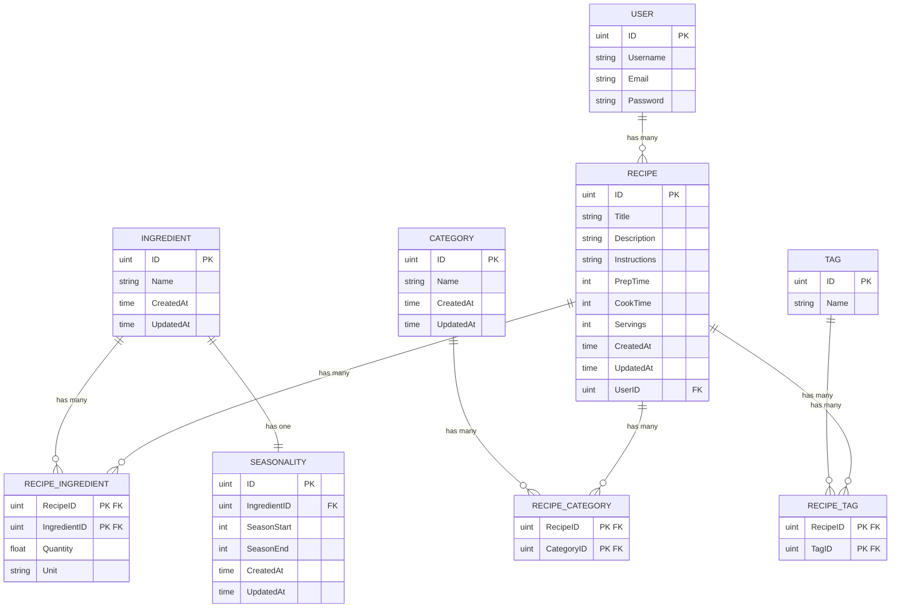

### Database Model Suitable for the project

```mermaid
erDiagram
    USER {
        uint ID PK
        string Username
        string Email
        string Password
    }

    RECIPE {
        uint ID PK
        string Title
        string Description
        string Instructions
        int PrepTime
        int CookTime
        int Servings
        time CreatedAt
        time UpdatedAt
        uint UserID "FK"
    }
    
    INGREDIENT {
        uint ID PK
        string Name
        time CreatedAt
        time UpdatedAt
    }
    
    SEASONALITY {
        uint ID PK
        uint IngredientID "FK"
        int SeasonStart
        int SeasonEnd
        time CreatedAt
        time UpdatedAt
    }

    CATEGORY {
        uint ID PK
        string Name
        time CreatedAt
        time UpdatedAt
    }

    TAG {
        uint ID PK
        string Name
    }

    RECIPE_INGREDIENT {
        uint RecipeID "PK FK"
        uint IngredientID "PK FK"
        float Quantity
        string Unit
    }

    RECIPE_CATEGORY {
        uint RecipeID "PK FK"
        uint CategoryID "PK FK"
    }

    RECIPE_TAG {
        uint RecipeID "PK FK"
        uint TagID "PK FK"
    }

    USER ||--o{ RECIPE : "has many"
    RECIPE ||--o{ RECIPE_INGREDIENT : "has many"
    RECIPE ||--o{ RECIPE_CATEGORY : "has many"
    RECIPE ||--o{ RECIPE_TAG : "has many"
    INGREDIENT ||--|| SEASONALITY : "has one"
    INGREDIENT ||--o{ RECIPE_INGREDIENT : "has many"
    CATEGORY ||--o{ RECIPE_CATEGORY : "has many"
    TAG ||--o{ RECIPE_TAG : "has many"
```